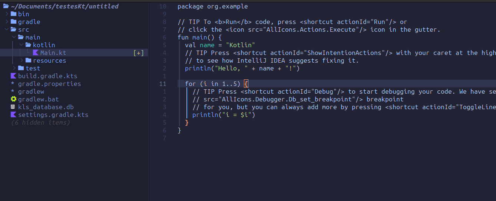

- After install Run ***Mason*** in your nvim to install manually all package listed.

### Java/Gradle/Kotlin

- checkstyle
- jdtls
- java-debug-adapter
- java-test
- vscode-java-decompiler
- gradle-language-server
- kotlin-language-server
- kotlin-debug-adap-ter
- klinter

----

### Rust

- rust-analyzer
- cpptools
- code-lldb
- trivy

